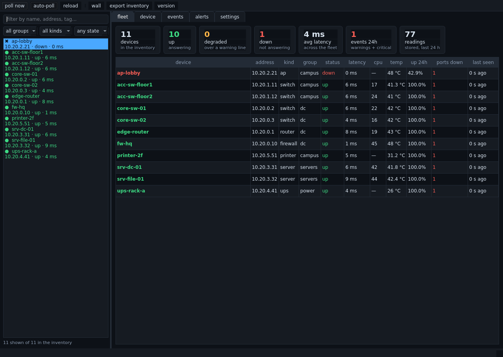
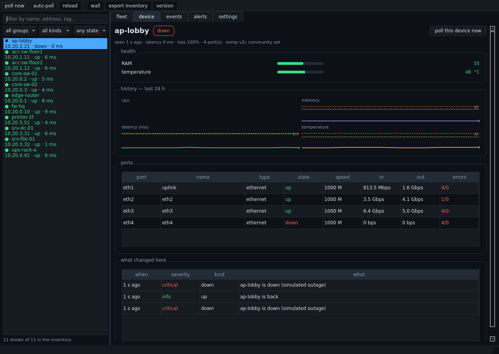

<div align="center">

# nocdeck

**A network monitoring dashboard for anything with an IP address — a switch, a router,
a firewall, a server, a UPS, a printer. Deep SNMP, history, thresholds, alerts, on your
screen and on the wall.**

[](https://github.com/sasoun1366/nocdeck/actions/workflows/test.yml)
[](https://github.com/sasoun1366/nocdeck/actions/workflows/release.yml)
[](https://www.python.org/)
[](nocdeck)
[](LICENSE)
[](https://t.me/luyavaai)



</div>

`nocdeck` polls your equipment over SNMP v1/v2c, and everything that does not speak SNMP
over ICMP, TCP and HTTP. It keeps the history, draws the graphs, watches the warning
lines and tells you when one is crossed — on Telegram, by email, or to a webhook. Two
front doors, one engine: a **web dashboard** you can open from anywhere and a **desktop
window** for the machine in the NOC.

No dependencies for the core. No agent to install on the monitored gear. No cloud, no
account, no telemetry: one SQLite file on your own disk.

## What it actually collects

Per device:

- **Health counters** — CPU, memory, temperature, fans, voltage, power, disk, battery
  runtime, and **optical transceiver power (dBm)** where the gear exposes it.
- **Every port** — state, speed, in/out traffic as bits per second, utilisation, error
  and discard counters, and the change detection that spots a flapping link.
- **Sensors** — the whole `ENTITY-SENSOR-MIB` table when a chassis has one, plus PoE
  power per port.
- **Reachability** — latency and packet loss, plus TCP ports and an HTTP(S) check with
  certificate expiry, for the devices that have no SNMP at all.

Per fleet: 24-hour availability, event history, threshold crossings, and a per-device
timeline you can scroll back through.

## What it looks like

```console
$ nocdeck summary --table
   name                   address         kind      status    latency cpu / temp  seen
   acc-sw-floor1          10.20.1.11      switch    up        2 ms    cpu 14% 39°C 19:58:18
   acc-sw-floor2          10.20.1.12      switch    up        8 ms    cpu 41% 41°C 19:58:18
   ap-lobby               10.20.2.21      ap        up        5 ms    44°C        19:58:18
   core-sw-01             10.20.0.2       switch    up        7 ms    cpu 17% 41°C 19:58:18
   core-sw-02             10.20.0.3       switch    up        4 ms    cpu 1% 34°C 19:58:18
   edge-router            10.20.0.1       router    up        1 ms    cpu 12% 39°C 19:58:18
   fw-hq                  10.20.0.10      firewall  up        3 ms    cpu 54% 52°C 19:58:18
   printer-2f             10.20.5.51      printer   up        2 ms    25°C        19:58:18
   srv-dc-01              10.20.3.31      server    up        3 ms    cpu 60% 47°C 19:58:18
   srv-file-01            10.20.3.32      server    up        5 ms    cpu 70% 50°C 19:58:18
   ups-rack-a             10.20.4.41      ups       up        4 ms    19°C        19:58:18
```

The desktop window, with a device open:

<div align="center">

</div>

And the wall view — one card per device, dark, no controls, meant to be left on a screen.
`nocdeck serve`, then open `/wall`; a saved copy is in
[docs/wall.html](docs/wall.html), and the fleet page is in
[docs/dashboard.html](docs/dashboard.html).

## Install

```bash
pip install nocdeck                 # the command line and the web dashboard
pip install "nocdeck[desktop]"      # and the window (PyQt6)
```

On the dashboard side of the house that is all there is — Python 3.9+ and nothing else.
For the desktop window, Linux also wants the usual Qt system libraries
(`libxkbcommon0`, `libegl1`, `libgl1`, `libxcb-cursor0`).

## Sixty seconds from nothing to a dashboard

```bash
nocdeck demo
```

That builds **eleven imaginary devices** — a core switch pair, access switches, a
firewall, a router, servers, a printer and a UPS — answers every SNMP query with a fake
agent that implements the same OIDs a real one would, polls them through the real
collector, thresholds, database and dashboard, and serves it on
<http://localhost:8090>. Ninety seconds in, the lobby access point loses power and the
alerts fire; four minutes in, a port drops; on the file server, a temperature climbs
toward its warning line. Nothing is faked after the SNMP socket: what the demo shows you
is what a real switch would drive.

Then point it at your own network:

```bash
nocdeck scan 10.20.1.0/24 --accept --group campus   # find gear and keep what answers
nocdeck scan 10.20.1.10-40 --communities public,private
nocdeck add 10.20.0.2 --name core-sw-01 --kind switch --group dc
nocdeck serve                                       # the web dashboard
nocdeck desktop                                     # the same thing, in a window
```

(The `scan` sweep tries the communities you give it, in order, and reports which one
answered. SNMP v3 is *detected* and reported — the standard library has no AES or DES,
so v3 needs `pysnmp`, and the tool says so instead of pretending.)

## Alerts that behave

Warning lines per metric, per device or fleet-wide. Then:

```bash
nocdeck alert add telegram ops --token <bot-token> --chat -1001234567890
nocdeck alert add email noc --server smtp.example.net --to noc@example.net
nocdeck alert add webhook hooks --url https://hooks.example.net/noc
nocdeck alert test ops
```

Four rules make the difference between an alert channel people trust and one they mute:

- **One message per problem, not per poll.** State changes are what get sent; a port
  that is still down is not news. (Recovery is news — and a target that only wants
  criticals can ask for `--min-severity critical` and not be woken by warnings.)
- **Storms become digests.** More than a handful in one cycle and they arrive as a
  single counted message instead of nine separate ones.
- **Quiet hours exist, and criticals ignore them.** A device that dies at 3 a.m. is why
  you built this; a warning can wait until morning.
- **A webhook gets JSON**, so it can drive whatever you already have.

The dashboard shows the same state, so "did anyone get told?" is answerable.

## Files, and where things live

```text
~/.nocdeck/nocdeck.db     every reading, event and port state, in one SQLite file
~/.nocdeck/config.json    thresholds, alert targets, poll interval, communities
```

Nothing else is written, and nothing is sent anywhere except the alerts you configure.
`nocdeck export` hands you the inventory as JSON; `nocdeck import` reads it back on
another machine — which is how you move a monitoring box without losing its history.

## Command line

```text
nocdeck scan      sweep a range and ask what is there
nocdeck add       add a device (or everything a scan found) to the inventory
nocdeck list      the inventory, with the last reading
nocdeck show      one device in detail, with its ports and its history
nocdeck poll      read the devices now
nocdeck watch     poll on a loop, in the foreground
nocdeck serve     the web dashboard
nocdeck desktop   the same dashboard as a window (needs PyQt6)
nocdeck demo      imaginary devices, real pipeline, live dashboard
nocdeck events    what changed
nocdeck summary   the fleet in one screen
nocdeck alert     where alerts go: telegram, email, webhook
nocdeck doctor    what is missing, in plain language
nocdeck export    the inventory as JSON
nocdeck import    read an inventory back
nocdeck version   what this is
```

## How it is built

Fifteen modules, no dependencies, and a rule for each one: `snmp` is the wire, `mibs` is
the data (add a vendor with a JSON file in `~/.nocdeck/mibs/`, no code), `poller` is the
cycle, `model` is the one place thresholds are decided, `store` is SQLite and nothing
else, `web` and `desktop` are two views with no logic of their own.

That last one is the important one: the window and the web page call the same
`store`, the same snapshot, the same thresholds. A device looks identical in both, and a
bug has one place to live.

`python -m pytest` runs 181 tests in about sixteen seconds. The suite needs no network:
the SNMP codec is driven with scripted sockets, the collector with a fake agent that
answers the real OIDs, the demo with the same simulator the command line uses. Two
things are worth knowing about it:

```bash
python -m pytest tests/test_snmp.py     # the wire format, byte for byte
python -m pytest tests/test_engine.py   # thresholds, hysteresis, rate arithmetic
```

See [docs/DESIGN.md](docs/DESIGN.md) for why the codec is hand-written and what each
module is allowed to know about the others.

## Requirements

Python 3.9 or newer. Linux, macOS, Windows. No root needed for SNMP polling — ICMP
falls back to TCP probes when the raw-socket permission is not there, which is why
`nocdeck scan` works as an ordinary user.

## Support the project

**nocdeck** is built and maintained in my own time, and it stays free. If it saved you
an evening of writing MIB walkers, you can help fund the next round:

**USDT (TRC20)**

```text
TMEyd1JZqdCjjKTc4zG2fhjzAYFKXCUWnA
```

For anything else, use the Telegram channel below. This wallet address is the only one
I publish for these projects.

## Stay updated

New releases are announced on Telegram: **[@luyavaai](https://t.me/luyavaai)** — version
notes, upgrade advice and practical network notes go there first. The other tools in
this series live there too.

## License

MIT — see [LICENSE](LICENSE).
